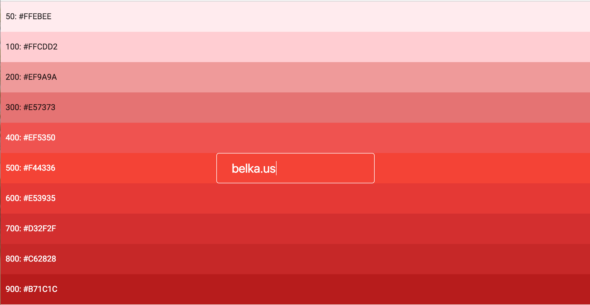

> _Material takes cues from contemporary architecture, road signs, pavement marking tape, and athletic courts. Color should be **unexpected** and **vibrant**._ ([https://material.google.com/style/color.html](https://material.google.com/style/color.html))

# Material color hashing

Hash a string to a Material Design color

[](https://badge.fury.io/js/material-color-hash)


A dead-simple library to hash a string to a {backgroundColor, textColor} tuple from the official Material Design palette.

Great for dynamically coloring your UI elements (badges, list icons, ..) with good-looking, vibrant colors and ensured text legibility.

# Interactive Demo
**[http://belkalab.github.io/material-color-hash/](http://belkalab.github.io/material-color-hash)**


## Usage

```bash
$ npm install material-color-hash
```

```js
var toMaterialStyle = require('material-color-hash');
// or, if you are on ES6:
// import toMaterialStyle from 'material-color-hash'

/* basic usage */
var fooStyle = toMaterialStyle('foo');
// fooStyle: {
//   backgroundColor: '#00BCD4',
//   color: 'rgba(0, 0, 0, 0.87)',
//   materialColorName: 'Cyan'
// }

/* select a different shade (default is 500) */
var fooStyle200 = toMaterialStyle('foo', '200');
// fooStyle200: {
//   backgroundColor: '#80DEEA',
//   color: 'rgba(0, 0, 0, 0.87)',
//   materialColorName: 'Cyan'
// }

var barStyle = toMaterialStyle('bar', 500);
// barStyle: {
//   backgroundColor: '#2196F3',
//   color: 'rgba(255, 255, 255, 1)',
//   materialColorName: 'Blue'
// }

/* also works with emoji! */
var emojiStyle = toMaterialStyle('😎');
// emojiStyle: {
//   backgroundColor: '#FFEB3B',
//   color: 'rgba(0, 0, 0, 0.87)',
//   materialColorName: 'Yellow'
// }
```

The returned object can be fed directly as a style prop to React components:


```js
import toMaterialStyle from 'material-color-hash';

const MaterialBadge = (props) => {
	const style = toMaterialStyle(props.text);

	return (
		<div
			className="badge"
			style={style}
		>
			{props.text}
		</div>
	);
}
```

For more information about Material Design colors and how to use them, check out the [official Material Design docs](https://material.google.com/style/color.html) by Google

## Contributors
[Giovanni Frigo](https://github.com/giovannifrigo), Developer @[Belka](https://github.com/BelkaLab)

## License
material-color-hash is Copyright (c) 2016-2018 Belka, srl. It is free software, and may be redistributed under the terms specified in the LICENSE file. (TL;DR: MIT license)

## About Belka


[Belka](http://belka.us/en) is a Digital Agency specialized in design, mobile applications development and custom solutions.
We love open source software! You can [see our projects](http://belka.us/en/portfolio/) or look at our case studies.

Interested? [Hire us](http://belka.us/en/contacts/) to help build your next amazing project.

[www.belka.us](http://belka.us/en)
